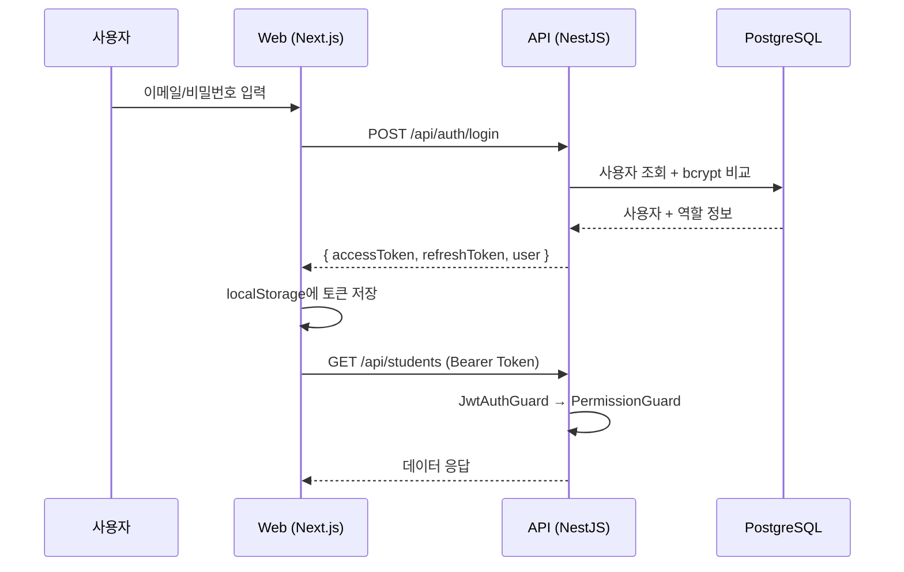

# 🏫 RKC ERP System — Technical Documentation

> **Royal Kids College** 유치원·학원 통합 ERP 시스템  
> **Version**: 0.1.0 | **Last Updated**: 2026-04-10

---

## 1. 프로젝트 개요

### 1.1 목적
Royal Kids College(RKC)의 유치원(Kindergarten)과 학원(Academy)을 통합 관리하는 ERP 시스템입니다. 원생 관리, 반 편성, 수납/청구, 지출 관리, 로열티 보고, 직원 권한 관리까지 교육기관 운영에 필요한 전체 기능을 포함합니다.

### 1.2 핵심 기능
| 모듈 | 설명 |
|------|------|
| **원생 관리** | 등록, 상태 변경, 건강관리(구강검진/건강검진), 반 배정 |
| **반 관리** | KINDERGARTEN/ACADEMY 유형별 반 생성, 학생·교사 배정 |
| **수납/청구** | 월별 자동 청구, 할인/프로모션 적용, 상태 워크플로우 |
| **인보이스** | 청구서 기반 자동 생성, HTML 미리보기 |
| **수금 관리** | 결제 수집, 미수금 추적, 연체 관리 |
| **지출 관리** | 지출 요청/승인/반려 워크플로우 |
| **로열티 관리** | 파트너사 로열티 계산 및 리포트 |
| **대시보드** | 실시간 KPI, 재무 요약, 차트 |
| **설정** | 기관 설정, SMTP, 비밀번호 변경 |
| **직원/권한** | 초대, 역할 기반 접근 제어(RBAC) |

---

## 2. 기술 스택

### 2.1 전체 아키텍처

```
┌─────────────────────────────────────────────────┐
│                    Client                        │
│         Next.js 16.2.2 (React 19)               │
│         TailwindCSS 4 + Shadcn UI               │
│              localhost:3000                       │
└───────────────────┬─────────────────────────────┘
                    │ REST API (JWT Bearer)
                    ▼
┌─────────────────────────────────────────────────┐
│                   API Server                     │
│           NestJS 10.4 + TypeScript               │
│           Prisma ORM 5.22                        │
│              localhost:4000/api                   │
└───────────────────┬─────────────────────────────┘
                    │
        ┌───────────┼───────────┐
        ▼           ▼           ▼
  ┌──────────┐ ┌─────────┐ ┌──────────┐
  │PostgreSQL│ │  Redis   │ │  Resend  │
  │ (Neon)   │ │(Upstash) │ │ (Email)  │
  └──────────┘ └─────────┘ └──────────┘
```

### 2.2 기술 상세

#### Backend (`apps/api`)
| 기술 | 버전 | 용도 |
|------|------|------|
| **NestJS** | 10.4 | REST API 프레임워크 |
| **TypeScript** | 5.5+ | 타입 안전 개발 |
| **Prisma ORM** | 5.22 | DB 접근 및 마이그레이션 |
| **PostgreSQL** | 15+ | 메인 데이터베이스 (Neon 호스팅) |
| **Passport + JWT** | 10.0 | 인증/토큰 발급 |
| **bcrypt** | 5.1 | 비밀번호 해싱 |
| **BullMQ** | 5.25 | 비동기 작업 큐 |
| **Resend** | 4.0 | 트랜잭셔널 이메일 |
| **class-validator** | 0.14 | DTO 유효성 검증 |

#### Frontend (`apps/web`)
| 기술 | 버전 | 용도 |
|------|------|------|
| **Next.js** | 16.2.2 | SSR/SSG 프레임워크 (Turbopack) |
| **React** | 19.2.4 | UI 라이브러리 |
| **TailwindCSS** | 4.x | 유틸리티 CSS |
| **Shadcn UI** | 4.2 | 컴포넌트 라이브러리 |
| **next-intl** | 4.9 | 국제화 (다국어 지원: en/ko) |
| **Recharts** | 3.8 | 차트/그래프 |
| **Framer Motion** | 12.38 | 애니메이션 |
| **Lucide React** | 1.7 | 아이콘 |
| **Sonner** | 2.0 | 토스트 알림 |
| **React Hook Form + Zod** | 7.72 / 4.3 | 폼 관리 및 스키마 검증 |

#### 인프라/빌드
| 기술 | 용도 |
|------|------|
| **Turborepo** | 모노레포 빌드 시스템 |
| **npm Workspaces** | 패키지 의존성 관리 |
| **Neon** | 서버리스 PostgreSQL 호스팅 |
| **Upstash** | 서버리스 Redis |

---

## 3. 프로젝트 구조 (Monorepo)

```
RKC/
├── .env                          # 환경 변수 (공유)
├── .env.example                  # 환경 변수 템플릿
├── package.json                  # 루트 워크스페이스 정의
├── turbo.json                    # Turborepo 설정
│
├── apps/
│   ├── api/                      # ⚙️ Backend (NestJS)
│   │   ├── prisma/
│   │   │   ├── schema.prisma     # DB 스키마 (30+ 모델)
│   │   │   └── seed.ts           # 초기 데이터 시딩
│   │   └── src/
│   │       ├── main.ts           # 서버 엔트리포인트 (port 4000)
│   │       ├── app.module.ts     # 루트 모듈
│   │       ├── auth/             # 인증 (login, register, JWT)
│   │       ├── students/         # 원생 관리
│   │       ├── classes/          # 반 관리
│   │       ├── billing/          # 청구 관리
│   │       ├── invoices/         # 인보이스
│   │       ├── payments/         # 결제
│   │       ├── receivables/      # 미수금
│   │       ├── expenses/         # 지출
│   │       ├── dashboard/        # 대시보드 API
│   │       ├── settings/         # 시스템 설정
│   │       ├── users/            # 사용자
│   │       ├── permissions/      # 권한
│   │       ├── guardians/        # 보호자
│   │       ├── promotions/       # 할인/프로모션
│   │       ├── audit/            # 감사 로그
│   │       ├── prisma/           # PrismaService
│   │       ├── common/           # 공통 (Guards, Decorators)
│   │       └── shared/           # 상수 (Permissions)
│   │
│   └── web/                      # 🌐 Frontend (Next.js)
│       ├── messages/             # 다국어 번역 파일 (en.json, ko.json)
│       └── src/
│           ├── app/
│           │   └── [locale]/
│           │       ├── (auth)/   # 로그인 페이지
│           │       └── (dashboard)/  # 대시보드 레이아웃
│           │           ├── page.tsx           # 대시보드
│           │           ├── students/page.tsx  # 원생 관리
│           │           ├── classes/page.tsx   # 반 관리
│           │           ├── billing/page.tsx   # 청구 관리
│           │           ├── invoices/page.tsx  # 인보이스
│           │           ├── payments/page.tsx  # 결제 관리
│           │           ├── receivables/       # 미수금
│           │           ├── expenses/page.tsx  # 지출 관리
│           │           ├── royalty/page.tsx   # 로열티
│           │           ├── staff/page.tsx     # 직원 관리
│           │           └── settings/page.tsx  # 설정
│           ├── components/
│           │   ├── ui/           # Shadcn UI 컴포넌트 (22개)
│           │   ├── layout/       # AppSidebar, AppHeader
│           │   └── providers/    # AuthProviderWrapper
│           ├── hooks/
│           │   ├── use-auth.tsx  # 인증 컨텍스트/훅
│           │   └── use-mobile.ts
│           ├── lib/
│           │   ├── api.ts        # API 클라이언트 (fetch wrapper)
│           │   └── utils.ts      # cn() 유틸리티
│           └── i18n/             # next-intl 설정
│
└── packages/
    └── shared/                   # 📦 공유 패키지
        └── src/
            ├── constants/roles.ts
            └── enums/
```

---

## 4. 데이터베이스 스키마

### 4.1 ERD 개요 (30+ 모델)

```mermaid
erDiagram
    User ||--o| StaffProfile : has
    User }o--|| Role : belongs_to
    Role ||--o{ RolePermission : has
    Permission ||--o{ RolePermission : has
    User ||--o{ UserPermission : has
    
    Student ||--o{ ClassStudent : enrolled_in
    Student ||--o{ StudentGuardian : has
    Student ||--o{ Billing : billed
    Student ||--o{ DentalCheckup : has
    Student ||--o{ HealthCheckup : has
    
    Class ||--o{ ClassStudent : contains
    Class ||--o{ TeacherAssignment : assigned
    
    Billing ||--o{ BillingItem : contains
    Billing ||--o| Invoice : generates
    Billing ||--o{ Payment : receives
    Billing ||--o| Receivable : creates
    
    Expense ||--o{ ExpenseApproval : approved_by
    Expense ||--o{ ExpenseAttachment : has
```

### 4.2 핵심 모델 설명

| 모델 | 설명 | 주요 필드 |
|------|------|----------|
| `User` | 시스템 사용자 (직원) | email, role, isActive |
| `Role` | 역할 (OWNER, ADMIN 등) | code, permissions |
| `Permission` | 세분화된 권한 | code (예: `student.view`) |
| `Student` | 원생 | studentCode, programType, status |
| `Guardian` | 보호자 | name, phone, relation |
| `Class` | 반 | classType, capacity |
| `DentalCheckup` | 구강검진 (연 2회) | year, round, findings |
| `HealthCheckup` | 건강검진 | height, weight, vision |
| `Billing` | 월별 청구서 | status, totalAmount, paidAmount |
| `BillingItem` | 청구 항목 | itemName, originalAmount, discount |
| `Invoice` | 세금계산서 | invoiceNo, status |
| `Payment` | 결제 기록 | amount, paymentMethod |
| `Receivable` | 미수금 | amount, dueDate, isOverdue |
| `Expense` | 지출 | category, status, approvals |
| `AuditLog` | 감사 로그 | action, entity, details |
| `OrganizationSetting` | 기관 설정 | key-value store |

### 4.3 주요 Enum 타입

| Enum | 값 |
|------|-----|
| `ProgramType` | KINDERGARTEN, ACADEMY, BOTH |
| `StudentStatus` | PENDING, ACTIVE, ON_LEAVE, WITHDRAWN |
| `BillingStatus` | DRAFT → ISSUED → PARTIALLY_PAID → PAID / OVERDUE / CANCELLED |
| `ExpenseStatus` | DRAFT → SUBMITTED → APPROVED / REJECTED → PAID → CLOSED |
| `InvoiceStatus` | GENERATED → SENT_INTERNAL → DOWNLOADED / VOIDED |

---

## 5. API 엔드포인트

> 모든 API는 `http://localhost:4000/api` prefix를 사용합니다.  
> 인증이 필요한 API는 `Authorization: Bearer <token>` 헤더가 필요합니다.

### 5.1 인증 (`/api/auth`)

| Method | Path | 설명 | 인증 |
|--------|------|------|------|
| `POST` | `/auth/login` | 로그인 (JWT 발급) | ❌ |
| `POST` | `/auth/refresh` | 토큰 갱신 | ❌ |
| `POST` | `/auth/invite` | 직원 초대 | ✅ `staff.invite` |
| `POST` | `/auth/accept-invitation` | 초대 수락 | ❌ |
| `PATCH` | `/auth/change-password` | 비밀번호 변경 | ✅ |

### 5.2 원생 관리 (`/api/students`)

| Method | Path | 설명 | 권한 |
|--------|------|------|------|
| `GET` | `/students` | 목록 조회 (페이징, 필터) | `student.view` |
| `GET` | `/students/stats` | 통계 | `student.view` |
| `GET` | `/students/:id` | 상세 조회 | `student.view` |
| `POST` | `/students` | 원생 등록 | `student.create` |
| `PUT` | `/students/:id` | 정보 수정 | `student.edit` |
| `DELETE` | `/students/:id` | 삭제 (청구이력 없을 때) | `student.delete` |
| `GET` | `/students/:id/dental` | 구강검진 이력 | `student.view` |
| `POST` | `/students/:id/dental` | 구강검진 기록 | `student.edit` |
| `GET` | `/students/:id/health` | 건강검진 이력 | `student.view` |
| `POST` | `/students/:id/health` | 건강검진 기록 | `student.edit` |

### 5.3 반 관리 (`/api/classes`)

| Method | Path | 설명 | 권한 |
|--------|------|------|------|
| `GET` | `/classes` | 반 목록 | `class.view` |
| `GET` | `/classes/:id` | 반 상세 | `class.view` |
| `POST` | `/classes` | 반 생성 | `class.create` |
| `PUT` | `/classes/:id` | 반 수정 | `class.create` |
| `DELETE` | `/classes/:id` | 반 삭제 (학생 0명일 때) | `class.delete` |
| `POST` | `/classes/:id/students` | 학생 배정 | `class.assign_student` |
| `DELETE` | `/classes/:id/students/:studentId` | 학생 해제 | `class.assign_student` |
| `POST` | `/classes/:id/teachers` | 교사 배정 | `class.assign_teacher` |
| `DELETE` | `/classes/:id/teachers/:userId` | 교사 해제 | `class.assign_teacher` |

### 5.4 청구/재무 (`/api/billing`, `/api/invoices`, `/api/payments`)

| Method | Path | 설명 |
|--------|------|------|
| `POST` | `/billing` | 청구서 생성 (DRAFT) |
| `GET` | `/billing` | 청구 목록 (월별 필터) |
| `GET` | `/billing/:id` | 청구 상세 |
| `PUT` | `/billing/:id` | 청구 수정 (DRAFT만, OWNER) |
| `DELETE` | `/billing/:id` | 청구 삭제 (결제이력 없을 때, OWNER) |
| `PATCH` | `/billing/:id/issue` | 청구 발행 |
| `POST` | `/billing/:id/payments` | 결제 등록 |
| `PATCH` | `/billing/:id/cancel` | 청구 취소 |
| `GET` | `/invoices` | 인보이스 목록 |
| `GET` | `/invoices/:id/html` | 인보이스 HTML 미리보기 |
| `GET` | `/payments` | 결제 이력 |
| `GET` | `/receivables` | 미수금 목록 |

### 5.5 지출 (`/api/expenses`)

| Method | Path | 설명 |
|--------|------|------|
| `POST` | `/expenses` | 지출 등록 |
| `GET` | `/expenses` | 지출 목록 |
| `PATCH` | `/expenses/:id/approve` | 승인 |
| `PATCH` | `/expenses/:id/reject` | 반려 |

### 5.6 기타

| Method | Path | 설명 |
|--------|------|------|
| `GET` | `/dashboard` | 대시보드 데이터 |
| `GET` | `/dashboard/royalty` | 로열티 보고서 |
| `GET` | `/settings` | 기관 설정 조회 |
| `PUT` | `/settings` | 기관 설정 수정 |

---

## 6. 권한 시스템 (RBAC)

### 6.1 역할 정의

| 역할 | 코드 | 권한 수 | 설명 |
|------|------|---------|------|
| **Owner** | `OWNER` | 29 (전체) | 시스템 최고 관리자, 모든 기능 접근 |
| **Admin** | `ADMIN` | 12 | 일반 관리자 (원생·반 관리, 조회) |
| **Finance** | `FINANCE` | 15 | 재무 담당 (청구·결제·지출 관리) |
| **Academic Manager** | `ACADEMIC_MANAGER` | 6 | 학사 관리자 (원생·반 관리만) |
| **Viewer** | `VIEWER` | 8 | 조회 전용 |
| **Partner** | `PARTNER` | 3 | 파트너사 (청구·인보이스·대시보드 조회만) |

### 6.2 권한 매트릭스

| 권한 그룹 | OWNER | ADMIN | FINANCE | PARTNER |
|-----------|:-----:|:-----:|:-------:|:-------:|
| 원생 CRUD | ✅ | ✅ 조회/생성/수정 | ❌ | ❌ |
| 원생 삭제 | ✅ | ❌ | ❌ | ❌ |
| 반 관리 | ✅ | ✅ | ❌ | ❌ |
| 반 삭제 | ✅ | ❌ | ❌ | ❌ |
| 청구 관리 | ✅ | 조회만 | ✅ | 조회만 |
| 청구 삭제 | ✅ | ❌ | ❌ | ❌ |
| 지출 승인 | ✅ | ❌ | ✅ | ❌ |
| 직원 초대 | ✅ | ❌ | ❌ | ❌ |
| 설정 변경 | ✅ | ❌ | ❌ | ❌ |

### 6.3 권한 적용 방식 (API)

```typescript
// 컨트롤러에서 데코레이터로 선언적 권한 관리
@UseGuards(JwtAuthGuard, PermissionGuard)
@RequirePermissions(PERMISSIONS.STUDENT_DELETE)
async delete(@Param('id') id: string) { ... }
```

### 6.4 권한 적용 방식 (Frontend)

```typescript
// useAuth 훅으로 역할 기반 UI 제어
const { user } = useAuth();
const isOwner = user?.role?.code === 'OWNER';

// 조건부 렌더링
{isOwner && <Button>삭제</Button>}
```

---

## 7. 인증 흐름



### 토큰 관리
- **Access Token**: JWT, 기본 7일 만료
- **Refresh Token**: JWT, 기본 30일 만료
- **저장 위치**: `localStorage` (`access_token`, `refresh_token`, `user`)
- **401 응답 시**: 자동으로 토큰 삭제 후 로그인 페이지로 리다이렉트

---

## 8. 프론트엔드 페이지 구성

### 8.1 사이드바 메뉴 (11개)

| 순서 | 메뉴 | 경로 | 기능 |
|------|------|------|------|
| 1 | Dashboard | `/en` | KPI, 차트, 재무 요약 |
| 2 | Students | `/en/students` | 원생 목록, 등록, 상세(건강관리) |
| 3 | Classes | `/en/classes` | 반 카드, 학생/교사 배정 |
| 4 | Billing | `/en/billing` | 월별 청구, 상태 관리 |
| 5 | Invoices | `/en/invoices` | 인보이스 목록, HTML 미리보기 |
| 6 | Payments | `/en/payments` | 결제 이력, 필터 |
| 7 | Receivables | `/en/receivables` | 미수금 추적 |
| 8 | Expenses | `/en/expenses` | 지출 등록, 승인/반려 |
| 9 | Royalty | `/en/royalty` | 로열티 리포트 |
| 10 | Staff & Permissions | `/en/staff` | 직원 초대, 역할 배정 |
| 11 | Settings | `/en/settings` | 기관 설정, 비밀번호 변경 |

### 8.2 주요 UI 패턴

- **데이터 테이블**: 검색, 필터, 페이지네이션 포함
- **상세 Dialog**: 테이블 행 클릭 → Shadcn Dialog로 상세 정보 표시
- **CRUD 버튼**: 역할 기반 조건부 렌더링 (OWNER만 삭제 버튼)
- **AlertDialog**: 삭제 확인 (confirm() 대신 Shadcn AlertDialog 사용)
- **토스트 알림**: Sonner 컴포넌트로 성공/실패 알림
- **차트**: Recharts 기반 (대시보드 월별 매출, 프로그램별 비율)

### 8.3 컴포넌트 구조

```
components/
├── ui/                    # Shadcn UI (22개 컴포넌트)
│   ├── alert-dialog.tsx   # 삭제 확인 모달
│   ├── dialog.tsx         # 상세/생성/수정 모달
│   ├── button.tsx         # 버튼 variants
│   ├── sidebar.tsx        # 사이드바 (앱 셸)
│   ├── table.tsx          # 테이블
│   ├── select.tsx         # 드롭다운 선택
│   ├── input.tsx          # 입력 필드
│   └── ...
├── layout/
│   └── app-shell.tsx      # AppSidebar + AppHeader
└── providers/
    └── auth-wrapper.tsx   # AuthProvider (클라이언트 컴포넌트)
```

---

## 9. API 클라이언트 (`lib/api.ts`)

프론트엔드에서 백엔드 API를 호출하는 싱글톤 클라이언트:

```typescript
class ApiClient {
  // localStorage에서 JWT 토큰 가져오기
  private getToken(): string | null { ... }
  
  // URL 빌드 (쿼리 파라미터 포함)
  private buildUrl(path: string, params?): string { ... }
  
  // 공통 request (토큰 자동 첨부, 401 처리)
  async request<T>(path: string, options?): Promise<T> { ... }
  
  // HTTP 메서드별 Wrapper
  get<T>(path, params?)    // GET
  post<T>(path, data?)     // POST
  put<T>(path, data?)      // PUT
  patch<T>(path, data?)    // PATCH
  delete<T>(path)          // DELETE
}

export const api = new ApiClient();
```

**사용 예시:**
```typescript
// 학생 목록 조회
const students = await api.get('/students', { status: 'ACTIVE', page: 1 });

// 학생 생성
await api.post('/students', { firstName: '길동', lastName: '홍', ... });

// 반 삭제
await api.delete(`/classes/${classId}`);
```

---

## 10. 환경 설정 및 실행 가이드

### 10.1 필수 요구사항
- **Node.js**: 18.0.0 이상
- **npm**: 10.0.0 이상
- **PostgreSQL**: Neon 또는 로컬 15+ 버전

### 10.2 초기 설정

```bash
# 1. 저장소 클론
git clone <repo-url> RKC && cd RKC

# 2. 환경 변수 설정
cp .env.example .env
# .env 파일에서 DATABASE_URL, JWT_SECRET 등 실제 값으로 수정

# 3. 의존성 설치
npm install

# 4. DB 스키마 적용
cd apps/api
npx prisma db push

# 5. Prisma 클라이언트 생성
npx prisma generate

# 6. 초기 데이터 시딩 (Owner 계정, 역할, 권한, 샘플 데이터)
npx ts-node prisma/seed.ts
```

### 10.3 개발 서버 실행

```bash
# 방법 1: 개별 실행 (추천)
# 터미널 1 - API 서버
cd apps/api && npx nest start --watch

# 터미널 2 - Web 서버
cd apps/web && npx next dev --turbopack

# 방법 2: Turborepo로 동시 실행
npm run dev
```

### 10.4 기본 계정

| 구분 | 값 |
|------|-----|
| **이메일** | `sunny@i-tudy.com` |
| **비밀번호** | `owner123456` |
| **역할** | OWNER (전체 권한) |

### 10.5 주요 포트

| 서비스 | 포트 | URL |
|--------|------|-----|
| Web (Next.js) | 3000 | `http://localhost:3000` |
| API (NestJS) | 4000 | `http://localhost:4000/api` |
| Prisma Studio | 5555 | `npx prisma studio` |

---

## 11. 비즈니스 규칙 요약

### 11.1 삭제 정책

| 엔티티 | 삭제 조건 | 권한 |
|--------|----------|------|
| 원생 | 청구(Billing) 이력이 없어야 함 | `OWNER` 전용 |
| 반 | 활성 학생이 0명이어야 함 | `OWNER` 전용 |
| 청구서 | DRAFT 상태이고 결제 이력이 없어야 함 | `OWNER` 전용 |

### 11.2 청구 워크플로우
```
DRAFT → (발행) → ISSUED → (결제) → PARTIALLY_PAID → (완납) → PAID
                      ↘ (연체) → OVERDUE
                      ↘ (취소) → CANCELLED
```

### 11.3 지출 워크플로우
```
DRAFT → SUBMITTED → APPROVED → PAID → CLOSED
                  ↘ REJECTED
```

### 11.4 건강관리
- **구강검진**: 연 2회 고정 (1회차, 2회차), 검진일/결과/특이사항 기록
- **건강검진**: 키(cm), 몸무게(kg), 시력(좌/우), 혈액형, 특이사항

---

## 12. 다국어 지원 (i18n)

`next-intl`을 사용하며, 메시지 파일은 `apps/web/messages/` 디렉토리에 위치합니다:

- `en.json` — 영어 (기본)
- `ko.json` — 한국어

**지원 라우팅**: `/{locale}/...` (예: `/en/students`, `/ko/students`)

---

## 13. 감사 로그 (Audit Log)

모든 주요 CRUD 작업은 `AuditLog` 테이블에 자동 기록됩니다:

```typescript
await this.auditService.log({
  userId,
  action: AuditAction.DELETE,
  entity: 'class',
  entityId: id,
  details: { name: cls.name, classType: cls.classType },
});
```

기록되는 작업: `CREATE`, `UPDATE`, `DELETE`, `STATUS_CHANGE`, `LOGIN`, `LOGOUT`, `PERMISSION_CHANGE`, `BILLING_GENERATED`, `INVOICE_GENERATED`, `PAYMENT_COLLECTED`, `EXPENSE_APPROVED`, `EXPENSE_REJECTED`

---

## 14. 알려진 이슈 및 향후 계획

### 14.1 알려진 이슈

> [!WARNING]
> - Neon DB가 유휴 시 절전 모드로 전환될 수 있어 첫 요청 시 cold start 지연(3-5초) 발생
> - Turbopack 환경에서 간헐적 모듈 해석 오류 발생 가능 → `.next` 캐시 삭제 후 재시작으로 해결

### 14.2 향후 개발 예정
- [ ] 선생님/매니저 → 오너 **승인 워크플로우** (청구 데이터 수정 시)
- [ ] **이메일 발송** 기능 연동 (인보이스, 결제 안내)
- [ ] **대시보드** 실시간 WebSocket 업데이트
- [ ] **파일 업로드** (지출 영수증 첨부)
- [ ] **프로덕션 배포** (Docker + CI/CD)
- [ ] **모바일 앱** 연동 (보호자/교사용)

---

## 15. 트러블슈팅

### DB 연결 오류
```bash
# Prisma 클라이언트 재생성
cd apps/api && npx prisma generate

# DB 스키마 재적용
npx prisma db push --force-reset  # ⚠️ 데이터 초기화됨
npx ts-node prisma/seed.ts        # 시드 데이터 복원
```

### Turbopack 캐시 오류
```bash
# .next 캐시 삭제 후 재시작
cd apps/web
Remove-Item -Recurse -Force .next
npx next dev --turbopack
```

### API 서버 포트 충돌
```bash
# Windows에서 포트 사용 프로세스 확인
netstat -ano | findstr :4000
taskkill /PID <PID> /F
```

---

> **문서 작성자**: AI Assistant  
> **최초 작성일**: 2026-04-10  
> **대상**: 개발자, 운영 담당자, 신규 입사자 인수인계용
